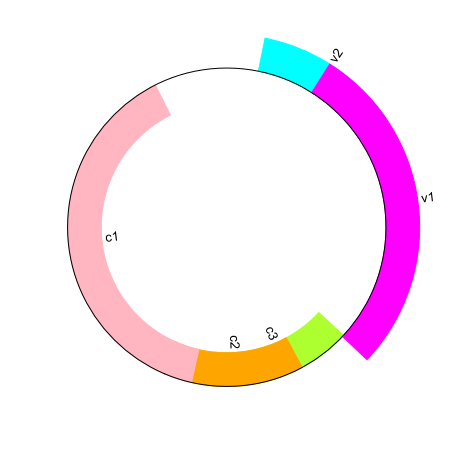

# ACM Research Coding Challenge (Spring 2021) - Rishi Villa

Description of the Solution:

Since the instructions recommended Python, I used Python since it was the easiest language to find libraries with. I used the Biopython library in Python to access the genome file given in the assignment. I used a read function since there was only a single record to get the data from the file. After creating a diagram of the genbank file, I color coded the features and then drew the map on a PNG file using set dimensions with their respective labels.

Sources used:
Bipython Documentation : https://biopython.org/wiki/Documentation

Libraries used:
Bipython,
 SeqIO Package,
 Reportlab 
